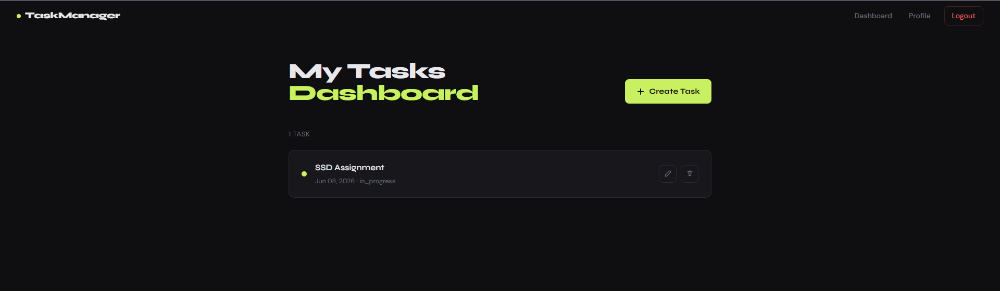
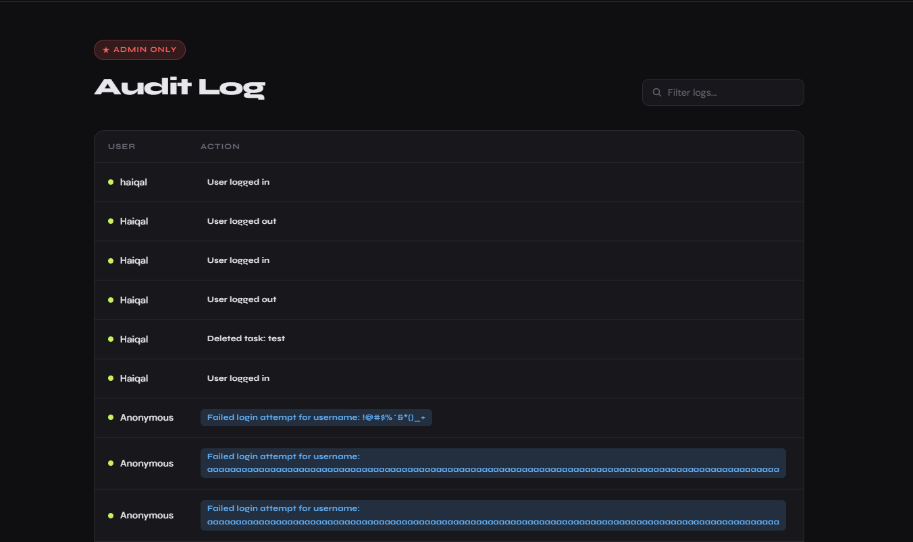

# Secure Task Manager

A secure web application developed as part of IKB21503 Secure Software Development coursework at UniKL MIIT.

## Built With
- Django 4.2 (Python)
- SQLite (development)
- Argon2 password hashing
- OWASP ZAP for security testing

## Security Features
- OWASP Top 10 compliance
- Role-Based Access Control (RBAC)
- CSRF protection
- Input validation and sanitization
- Secure session management
- Audit logging
- Argon2 password hashing
- UUID file upload renaming
- Content Security Policy (CSP)
- Custom error pages (404, 500)

## Installation

### Requirements
- Python 3.9+
- Git

### Steps
1. Clone the repository
git clone https://github.com/Imanshahhh/secure-task-manager.git

cd secure-task-manager

2. Create virtual environment
python -m venv venv

3. Activate virtual environment
Windows: venv\Scripts\activate

Linux/Mac: source venv/bin/activate

4. Install dependencies
pip install -r requirements.txt

5. Setup environment variables
copy .env.example .env
Then open `.env` and fill in your own `SECRET_KEY`

6. Run migrations
python manage.py migrate

7. Create admin account
python manage.py createsuperuser

## How to Run
python manage.py runserver
Visit `http://127.0.0.1:8000`

## Dependencies
See `requirements.txt` for full list. Key packages:
- django==4.2.30
- python-dotenv
- Pillow
- django-csp
- argon2-cffi

## Screenshots

